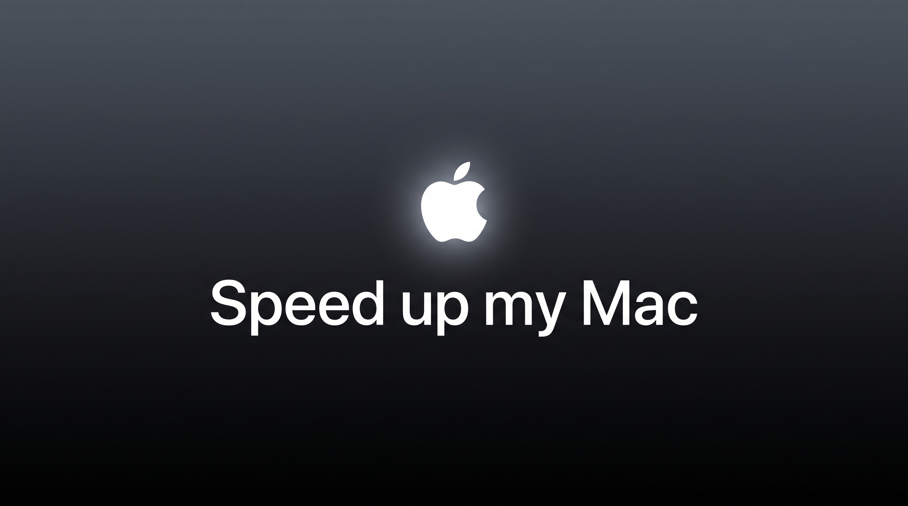

# Speed Up My Mac



Hey. Is your Mac slow? Hot? Are the fans spinning up like a tiny jet engine every time you join a Zoom call?

Try this. It will probably clean up some space, cool the thing down, and hand you back some speed you did not even know you lost.

Here is the quiet truth about Macs: they hoard junk, and nobody tells you.

- Every Wi-Fi network you have ever joined is saved, and your Mac keeps scanning for all of them. Forever. Even when you are plugged into ethernet. Join enough coffee shops and airport lounges and your laptop is running a little background search party around the clock.
- "Purgeable space" has been squatting on your drive for who knows how long. It looks free. It is not. You can absolutely get rid of it.
- Old installers in Downloads, caches the size of a small video game, a Desktop with a hundred icons quietly taxing your graphics, and the occasional runaway process that has been pinning a CPU core since last Tuesday. All of it, just sitting there, slowing you down.

This finds all of it and helps you clean it up. No app to buy. No subscription. No dependencies. It uses only the tools already built into macOS, and you can read the whole thing in two minutes.

Works on every Mac, Intel and Apple Silicon. It even knows the difference: Intel Macs run hot, so it leans on cooling; Apple Silicon runs cool, so it leans on memory and clutter.

## What it does

| Mode | When | What it does |
|---|---|---|
| `diagnose` | "why is my Mac hot or slow?" | Read only. Tells you exactly what is going on: heat, throttling, memory, runaway processes, saved Wi-Fi, clutter, reclaimable space. Touches nothing. |
| `deep` | The first big clean | Clears the junk that piled up, frees memory, flushes caches, then hands you a checklist of the bigger stuff to review. |
| `maintenance` | Weekly, going forward | The quick recurring pass. Cleans what regrows and flags anything pegging your CPU. In and out. |
| `call` | Right before a Zoom / Meet / Teams / live anything | Frees up heat and CPU so the fans do not spike and the video does not stutter mid-call. Fully reversible. |
| `restore` | After the call | Puts everything back the way it was. |

## The best part: it never nukes anything behind your back

The harmless stuff (caches that just redownload, freeing up memory) it handles on its own. Anything that actually matters (deleting a file, quitting a process, changing a setting) it shows you a list and **you tick the checkboxes** for what goes. Your files stay your files. Nothing gets deleted, quit, or changed without you saying so.

## Install

**The easy way (in Claude Code):** drop this folder at `~/.claude/skills/speed/` and just say "speed up my mac." Done.

**Standalone:** clone it and run the script.

```bash
git clone https://github.com/skyblueso/speed-up-my-mac
bash speed-up-my-mac/speed.sh diagnose
```

## Usage

```bash
bash speed.sh diagnose     # see what is going on (start here, it changes nothing)
bash speed.sh deep         # the big first clean
bash speed.sh maintenance  # the quick weekly tidy
bash speed.sh call         # before a live call
bash speed.sh restore      # after the call
```

A couple of steps need admin rights (pausing Spotlight, freeing memory). In a terminal it just asks for your password the normal way. In Claude Code it hands you the exact line to run. It never sees or stores your password.

## Is this safe?

Yes, and you do not have to take my word for it. It is one commented shell script. Read it. It never deletes a file without showing it to you first, never kills an app you are using, and never touches your iCloud. The cautious-by-default design is the whole point.

## License

MIT. Use it, share it, fork it. See [LICENSE](LICENSE).

Built by [Simcha Brodsky](https://github.com/skyblueso) ([@simchabrodsky](https://x.com/simchabrodsky)).
